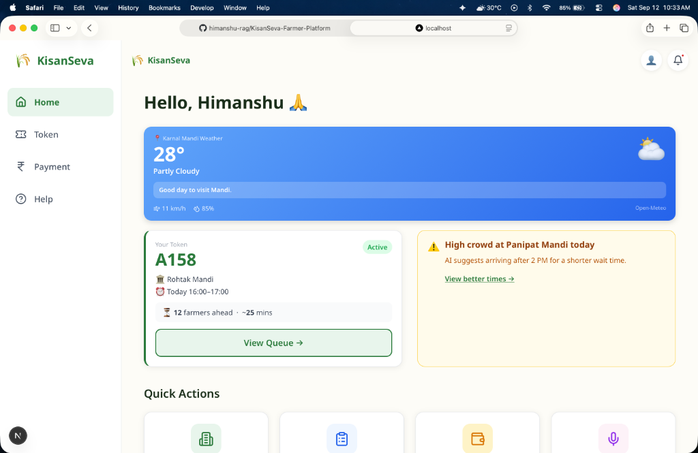
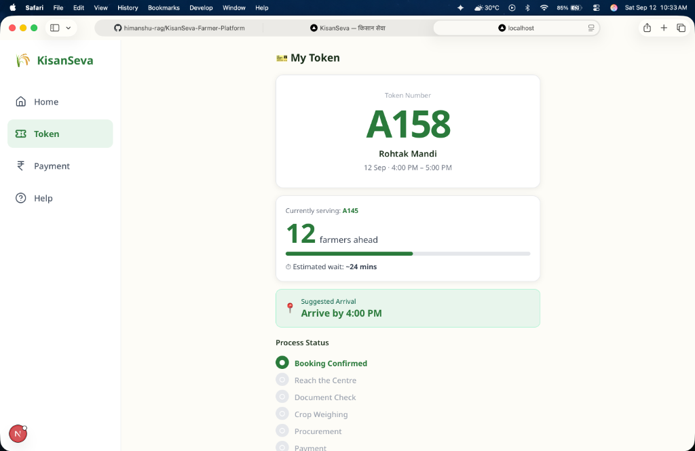
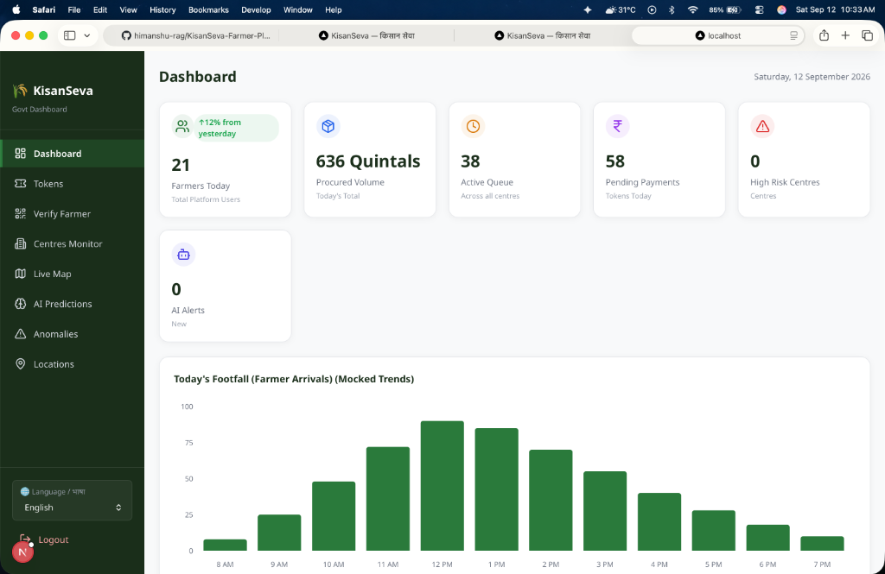

# 🌾 KisanSeva (किसान सेवा)

<div align="center">
  
  <br/>
  <h3>Smart Procurement & Farmer Assistance Platform</h3>
  <p>Empowering Indian Farmers with seamless crop sales, real-time queues, and AI-driven guidance.</p>
  
  
  
  
  
</div>

---

## 🌟 Overview

**KisanSeva** is a complete, dual-portal web application designed to solve the chaos of government crop procurement (Mandis). It provides a digitized, organized, and AI-powered workflow for both **Farmers** and **Mandi Administrators**.

### 📱 Farmer Portal (Mobile-First)
- **Smart Slot Booking:** Book specific dates and times to sell crops, drastically reducing waiting time.
- **Live Queue Tracking:** View live queue status (e.g., "12 farmers ahead of you") and estimated wait times.
- **AI Virtual Assistant (KisanSeva AI):** Voice & text-based AI assistant powered by Groq (LLaMA3) to answer questions seamlessly in Hindi and English.
- **Multilingual Support:** Full UI localization to support multiple regional languages (Hindi, English, Punjabi, Marathi).
- **Digital ID & QR Verification:** Generate a digital farmer profile with a unique QR code for instant identity verification.
- **Real-time Notifications:** Alerts for crowd warnings, payment processing, and queue status.

### 💻 Admin & Operator Portal (Desktop)
- **Live Dashboard:** Real-time metrics of active queues, procured volumes, and farmer count across all Mandis.
- **QR Scanning Verification:** Scan a farmer's digital ID to instantly pull up their token at the gate.
- **AI Predictions:** Forecast crowd density based on center capacity and scheduled tokens.
- **Token Management:** Move farmers through a streamlined pipeline: `Arrived` ➔ `Verified` ➔ `Weighed` ➔ `Procured`.
- **Anomaly Detection:** Automatically flag suspicious activities (e.g., mismatched crop yields or unusual token patterns).

---

## 🛠 Tech Stack

- **Framework:** [Next.js 15 (App Router)](https://nextjs.org/)
- **Language:** TypeScript
- **Styling:** Tailwind CSS (v4) + custom CSS Variables
- **Database:** SQLite (`node:sqlite`)
- **Authentication:** Custom JWT-based auth + OTP Verification
- **AI Integration:** Groq SDK (LLaMA 3 8B)
- **Icons & Charts:** Lucide React, Recharts

---

## 🚀 Getting Started

### 1. Clone the repository
```bash
git clone https://github.com/himanshu-rag/KisanSeva-Farmer-Platform.git
cd KisanSeva-Farmer-Platform
```

### 2. Install Dependencies
```bash
npm install
```

### 3. Set up Environment Variables
Create a `.env.local` file in the root directory. You can use the `.env.example` if available, or create one manually:
```env
# Required for AI Assistant
GROQ_API_KEY=your_groq_api_key_here

# Required for Authentication (JWT)
JWT_SECRET=your_super_secret_jwt_key

# Optional: SMS Gateways (Twilio or Fast2SMS) for real OTPs
# If left blank, OTPs will print to the local terminal for testing.
FAST2SMS_API_KEY=your_fast2sms_key
```

### 4. Run the Development Server
```bash
npm run dev
```

- Open **[http://localhost:3000/farmer](http://localhost:3000/farmer)** to view the Farmer Portal (Best viewed in mobile responsive mode).
- Open **[http://localhost:3000/admin/login](http://localhost:3000/admin/login)** to view the Admin Portal.
  - *Demo Admin Email:* `admin@sih.gov.in`
  - *Demo Admin Password:* `admin123`
- *Demo OTP Bypass Code:* `123456`

---

## 📸 Screenshots

*(Add screenshots of your application here by dragging and dropping them into the markdown file on GitHub!)*

<div align="center">
  <table>
    <tr>
      <td align="center"><b>Farmer Home</b></td>
      <td align="center"><b>Live Token Queue</b></td>
      <td align="center"><b>Admin Dashboard</b></td>
    </tr>
    <tr>
      <td></td>
      <td></td>
      <td></td>
    </tr>
  </table>
</div>

---

## 🛡 License
Built with ❤️ for Indian Farmers. Feel free to explore, fork, and learn from this codebase!

---

## 👥 Our Team

This project was proudly built by our team for the Smart India Hackathon (SIH).

- **Himanshu Rags**
- **Tushar Sharma** (sharmat3420@gmail.com)
- **Snehal Srivastava** (Snehalsrivastava06@gmail.com)
- **Paras Negi** (Parasnegi378@gmail.com)
- **Chhavi Jain** (chhavijain408@gmail.com)
- **Aarjav Jain** (jainsinghaiaarjav@gmail.com)
